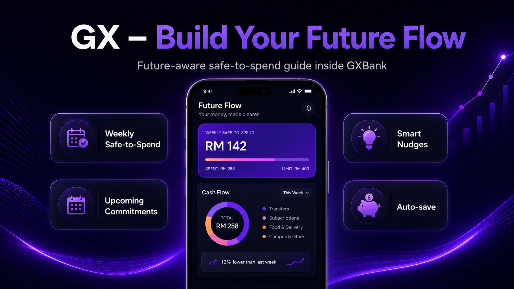
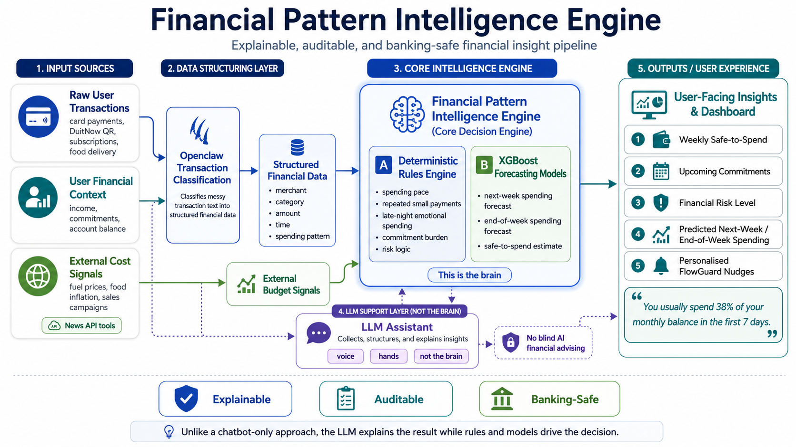

# GX - Build Your Future Flow

<p align="center">
  
</p>

<p align="center">
  <strong>See tomorrow's money today. Spend smarter. Save automatically.</strong>
</p>

<p align="center">
  FutureFlow is the interactive Flutter prototype for an AI-powered financial resilience feature inside GXBank, designed to help Malaysian youth understand what is truly safe to spend, react earlier to risky habits, and turn good behaviour into automatic savings growth.
</p>

<p align="center">
  
  
  
  
</p>

<p align="center">
  <a href="#highlights"><strong>Highlights</strong></a> •
  <a href="#problem"><strong>Problem</strong></a> •
  <a href="#solution"><strong>Solution</strong></a> •
  <a href="#architecture"><strong>Architecture</strong></a> •
  <a href="#usage"><strong>Usage</strong></a> •
  <a href="#installation"><strong>Installation</strong></a>
</p>

<a id="highlights"></a>
## 🌟 Highlights

- `Safe-to-spend`, not just visible balance: users see how much is actually available after commitments, savings goals, and buffers are protected.
- `FlowGuard` nudges add a spending brake before habits drift too far, especially around repeated, late-night, or emotional purchases.
- `Auto-Save + Streak` converts disciplined spending into automatic transfers into GX Savings Pockets.
- `Future Home` turns financial progress into a visible reward loop with `Flow Coins`, unlockable items, inventory, and room placement.
- The repo ships as a polished Flutter prototype with mock data, reusable design-system widgets, animations, charts, and multi-screen demo flows.

<a id="problem"></a>
## ⚠️ Problem

Young Malaysians are spending in a fast, digital, influence-driven environment, but most banking apps still only show a balance and a list of transactions. That creates a dangerous gap between what looks affordable and what is actually safe.

Based on the project evidence:

- Visa Malaysia's 2025 Gen Z study estimates Malaysia has about `7.7 million` Gen Z individuals aged `14 to 27`, or roughly `23%` of the population.
- The same study found `53%` of Gen Zs prefer digital-first payment tools, nearly `60%` own debit cards, and `48%` have purchased directly from social media ads.
- PIDM's savings report states that `55%` of respondents have less than `RM10,000` in available emergency savings.

That combination creates three core product problems:

1. `Visible balance creates false confidence.` Money needed for rent, transport, bills, subscriptions, savings goals, and emergency buffers is not clearly separated from spendable cash.
2. `Digital payments are too frictionless.` QR payments, transfers, cards, and tap-to-pay remove spending friction and make emotional decisions easier.
3. `Financial awareness does not automatically become action.` Users may know they should save, but cravings, stress, promotions, peer influence, and payday confidence still drive poor choices.

<a id="solution"></a>
## 💡 Solution

GX - Build Your Future Flow is an AI-powered financial resilience feature inside GXBank. Instead of only showing how much money a user has, it shows how much money they can safely spend this week after commitments, savings goals, and emergency protection are considered.

The experience is built around three product promises:

- `Safe-to-spend, not just balance.` Users get a future-aware weekly spending guide instead of a misleading raw balance.
- `Explainable intelligence, not blind LLM advice.` Rules and forecasting determine the risk signal, while language models help structure and explain insights.
- `Future-aware, not only history-based.` The concept considers upcoming commitments and external cost pressure, not only last week's transactions.

> [!NOTE]
> This repository currently implements the frontend prototype and demo interactions. The AI engine described below is the intended solution architecture, while the code in this repo uses local mock data to simulate the experience.

### Demo journeys already implemented in this repo

| Screen | What it demonstrates |
| --- | --- |
| `GXBank Home` | Account snapshot, quick actions, FutureFlow gateway, and recent activity |
| `FutureFlow Dashboard` | Weekly safe-to-spend hero, cash flow preview, streak status, FlowGuard status, and reward teaser |
| `Future Flow` | Upcoming commitments, weekly forecast, protected spending room, and end-of-week prediction |
| `Cash Flow` | Donut-chart breakdown of spending categories and category totals |
| `FlowGuard` | Night Lock and Recovery Nudge flows for risky spending patterns |
| `QR Pay Demo` | A full payment journey that ends with a FlowGuard alert banner |
| `Auto-Save History` | Weekly bar chart of leftover money automatically saved |
| `Savings Pockets` | GXBank pockets plus FutureFlow-managed savings pockets |
| `Future Home` | A reward room where items can be unlocked, placed, moved, and removed |
| `Mystery Shop` | Gacha-style reward unlock flow powered by Flow Coins |

<a id="architecture"></a>
## 🧠 Architecture

The solution is designed to be explainable and banking-safe. The LLM is not the decision maker. It is the interface layer that helps collect, structure, and explain signals.

<p align="center">
  
</p>

### Proposed intelligence flow

1. `Transaction intake`
   User transactions, recurring commitments, pocket goals, and behavioural patterns are collected from banking activity.
2. `Signal structuring`
   Openclaw is used to classify messy transaction text into structured financial categories. External news signals such as fuel price changes, food inflation, and campaign periods can also be ingested through News API tooling.
3. `Deterministic protection rules`
   Rules reserve essential commitments, savings goals, and emergency buffers before calculating what is actually safe to spend.
4. `Forecasting`
   XGBoost regression models estimate next-week and end-of-week spending patterns.
5. `User-facing explanation`
   The LLM turns those outputs into understandable nudges, summaries, and next-best actions inside the banking experience.

### Why this architecture matters

- `Auditable`: risk is calculated through rules and models that can be reviewed.
- `Explainable`: insights can be traced back to commitments, patterns, and forecast inputs.
- `Practical`: the system behaves more like a financial copilot than a generic AI chatbot.

<a id="usage"></a>
## 🚀 Usage

After launch, the app opens on the `GXBank` home screen. The best way to demo the current prototype is:

1. Tap `FutureFlow` to open the main dashboard.
2. Open `Future Flow` to see the weekly safe-to-spend number, commitments, and forecast.
3. Open `Cash Flow` to inspect the category donut chart and spend distribution.
4. Open `FlowGuard` to try `Night Lock` and `Recovery Nudge`.
5. Tap the `Streak` card to open the auto-save sheet, then jump into `Auto-Save History` or `Savings Pockets`.
6. Open `Future Home`, go to `Shop`, unlock a reward, return to inventory, and place the item in the room.

For the strongest story flow, use the product video sequence:

1. `Future Flow Dashboard`
2. `FlowGuard Nudges`
3. `Auto-Save + Streak`
4. `Future Home`

If you want the emotional spending scenario, go through `Home -> QR Pay -> Confirm Payment -> Payment Complete`, then tap the FlowGuard alert banner that appears after the payment.

## 🧱 Project Structure

```text
lib/
  app.dart                         # Router, shell, and app theme entry
  core/                           # Theme, colors, spacing, radii, formatting
  data/
    mock/                         # Static demo content
    models/                       # Typed view models for the screens
  features/
    auto_save_history/            # Auto-save chart flow
    cash_flow/                    # Spending breakdown screen
    dashboard/                    # FutureFlow overview dashboard
    flowguard/                    # Guardrail and QR-payment demo flow
    future_flow/                  # Safe-to-spend forecast screen
    future_home/                  # Reward room and placement state
    home/                         # GXBank-style landing screen
    savings_pockets/              # Pocket overview screens
    shell/                        # Bottom navigation shell
    shop/                         # Reward unlock experience
  shared/widgets/                 # Reusable UI building blocks
test/
  widget_test.dart                # App boot/smoke test
```

## 🛠️ Tech Stack

- `flutter` for the multi-platform application shell
- `flutter_riverpod` for app and reward-state management
- `go_router` for screen navigation
- `fl_chart` for bar and donut charts
- `flutter_animate` for transitions and motion
- `google_fonts` with `Plus Jakarta Sans` for typography

## 🎯 Target Market and Impact

This concept is aimed at Malaysian youth, especially students and fresh graduates who are just starting to manage money independently in a digital-first economy.

For users, the impact is simple:

- clearer day-to-day spending confidence
- earlier protection against emotional overspending
- automatic savings growth without relying only on discipline

For GXBank, the concept can help:

- increase daily app engagement
- drive stronger Savings Pocket adoption
- build long-term loyalty as users mature financially

## 👥 Team

We are `Team Misty`, and this concept is built around the idea that banking should not only show money, but help users protect and grow their future flow.

The current git history in this repository is authored by Benjamin Chew.

<a id="installation"></a>
## ⬇️ Installation

### Requirements

- Flutter SDK with Dart `^3.9.0`
- A configured Flutter device target for Android or iOS

### Run the app

```bash
flutter pub get
flutter run
```

To choose a specific target, list the available device ids with:

```bash
flutter devices
```

No backend setup, API key, or environment file is required for the current prototype.

## 🧪 Testing

Run the widget smoke test with:

```bash
flutter test
```

The existing test checks that the app boots and renders the FutureFlow shell labels.

## 🙌 Repo Notes

- The current experience is intentionally mock-driven and optimized for product demos, storytelling, and UI iteration.
- The proposed intelligence engine in this README is broader than the code currently wired into the app.
- The cover art used above comes from [`assets/CoverImage.png`](assets/CoverImage.png).
